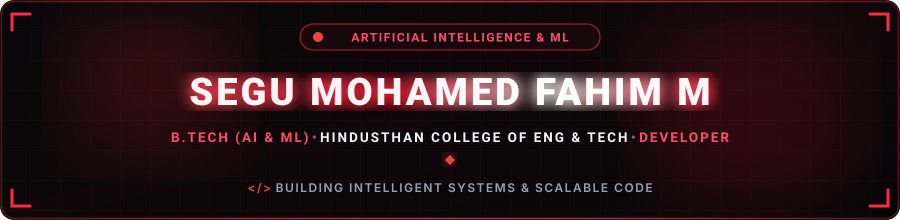
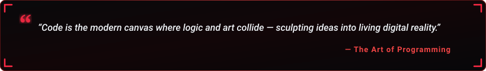

  

  

  
  &nbsp;
  
  &nbsp;
  

  

---

<h2 align="center">🔴 About Me</h2>

  

  

  Hey! I'm <b>Segu Mohamed Fahim M</b>, a 2nd-year B.Tech student specializing in <b>Artificial Intelligence and Machine Learning</b> at Hindusthan College Of Engineering and Technology, Coimbatore. 
  I have a strong foundation in C, C++, Java, Python, and web development, and I am driven by the passion to explore intelligent systems and build modern, scalable software applications.

  
  &nbsp;
  
  &nbsp;
  
  &nbsp;
  

  💬 <b>Let's Discuss:</b> C, C++, Java, Python, Web Development, MySQL, and Artificial Intelligence &amp; ML. 
  ⚡ <b>Philosophy:</b> <i>"Curiosity drives learning; consistent code brings ideas to reality."</i>

<table width="100%" border="0" align="center">
<tr>
<td width="50%" align="center" style="padding: 14px;">
  <h4>🎓 Academics</h4>
  
<b>Hindusthan College Of Engineering &amp; Technology</b> B.Tech &#8226; Artificial Intelligence &amp; Machine Learning (2nd Year)

</td>
<td width="50%" align="center" style="padding: 14px;">
  <h4>📍 Location</h4>
  
<b>Coimbatore, Tamil Nadu, India</b> Open to tech discussions &amp; internships

</td>
</tr>
<tr>
<td width="50%" align="center" style="padding: 14px;">
  <h4>🌱 Focus Areas</h4>
  
<b>Data Structures, AI/ML &amp; Web Dev</b> C, C++, Java, Python, Full Stack basics

</td>
<td width="50%" align="center" style="padding: 14px;">
  <h4>🤝 Collaboration</h4>
  
<b>AI, Machine Learning &amp; Software Projects</b> Open to collaborative development &amp; learning

</td>
</tr>
</table>

---

<h2 align="center">🛠️ Tech Stack &amp; Skills</h2>

<b>Core Programming Languages</b>

  

<b>Frontend Development</b>

  

<b>Backend &amp; Logic Development</b>

  

<b>Databases</b>

  

---

<h2 align="center">📊 GitHub Analytics &amp; Activity</h2>

  
  &nbsp;&nbsp;
  

  

  

---

<h2 align="center">⚡ Contribution Journey</h2>

  

---

<h2 align="center">📬 Let's Connect &amp; Collaborate</h2>

<i>Whether you want to discuss AI/ML ideas, collaborate on software projects, or just say hello — feel free to reach out!</i>

<table border="0" align="center">
<tr>
<td align="center" width="220" style="padding: 16px;">
  <a href="https://instagram.com/itz__fahi" target="_blank">
    
      
    
  </a>
   
  <b>Social &amp; Updates</b>
</td>
<td align="center" width="220" style="padding: 16px;">
  <a href="mailto:segumohamedfahim.m@gmail.com">
    
      
    
  </a>
   
  <b>Direct Communication</b>
</td>
<td align="center" width="220" style="padding: 16px;">
  <a href="https://github.com/segumohamedfahim" target="_blank">
    
      
    
  </a>
   
  <b>Code &amp; Repositories</b>
</td>
</tr>
</table>

  

